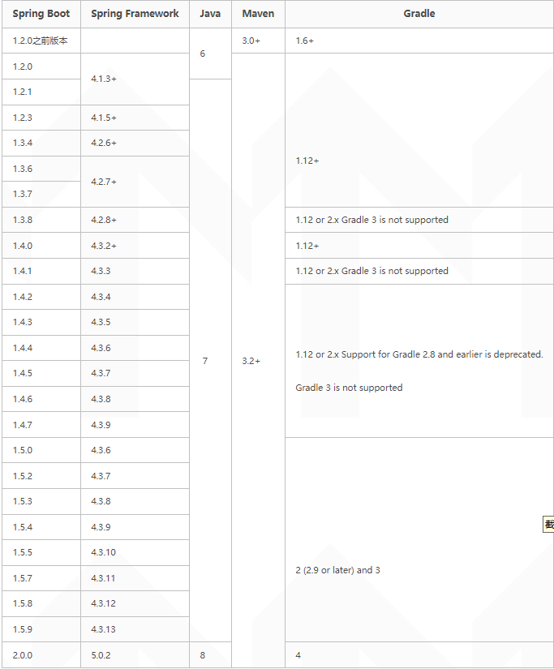

#ui-web-starter
##环境组件  
· JDK 1.8  
· Maven 3.6.3  
· SpringBoot 2.3.5.RELEASE  
· Mybatis    
· MySQL 5.7  
springboot与jdk版本支持情况列下：  

##FreeMarker
技术文档：https://www.oschina.net/p/freemarker?hmsr=aladdin1e1

##UI模板
在线演示：https://linzening.gitee.io/learun/#

##Axios中文文档
中文文档：http://www.axios-js.com/zh-cn/docs/

##富文本编辑器 wangEditor5
官网：https://www.wangeditor.com/  
在线演示：https://www.wangeditor.com/demo/index.html  
快速开始：https://www.wangeditor.com/v5/getting-started.html

